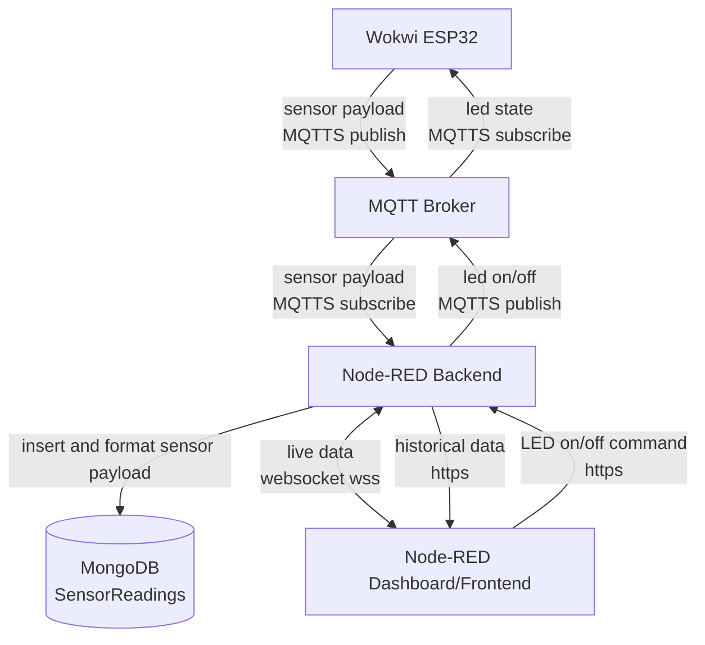

### 1) Project Links
- **Live Dashboard URL:** https://iot-production-d939.up.railway.app/dashboard/page1
- **Wokwi Simulation URL:** https://wokwi.com/projects/463269245300540417
- **Repository URL:** https://github.com/noomde/IoT
- **Short Demo Video:** https://www.youtube.com/watch?v=er_hH-Wtb1A
- **self-hosted broker report** https://github.com/noomde/IoT/blob/main/brokerReport.md

### 2) Project Overview
Briefly describe:
- What your project does.
- Which hardware/sensors you simulated.
- What the dashboard allows the user to monitor/control.

My project allows for an easy to understand graph which shows the temperature during the last 30 minutes (updates every 2 seconds). The application also allows users to turn on and off a switch in the wokwi simulation. There is also an table for all historical data and a small template that shows the latest updated temperature reding.

I have used the example wokwi simulation but changed the code a bit because of a windows issue I had earlier in the process. My wokwi simulation includes a led actuator, DHT22 sensor and an ESP32 as a microcontroller.

The dashboard has 3 included features
1. A graph that shows the temperature during the last 30 minutes.
2. A switch that allows the user to turn the led simulation in wokwi on and off.
3. A table to show all data from the database. In my case that would include studentId (ab226rf in all cases), deviceId (esp32-01 in all cases), type (temperature), value (24 or the actual temperature), unit (C all the time) and createdAt (the date the sensor sent the payload)
4. A template that shows the latest sensor reading from the wokwi simulation.

### 3) Architecture and Data Flow
Explain how data moves through your system:
- live data: Wokwi device -> MQTT broker -> processing layer/database -> dashboard.
- Led switch: Dashboard -> processing layer -> MQTT command topic -> device action.
- Historical data: processing layer/database -> dashboard.



### 4) Database Strategy
Document:
- **Database chosen:** MongoDB
- **Data model:** collection 
- **Time-series considerations:** retention, indexing, query strategy, aggregation, etc.

I choose to work with mongoDB just because it was available in railway and also because I am very used to it. mongoDB's data model is different collections and I have in this case only used a single collection for the sensor readings. The only type of time-series considerations I have made is with this command: db.SensorReadings.createIndex({ createdAt: -1 }). This makes the collection sorted and makes it easier for it to find the last 30 minutes of data.

### 5) MQTT Topics and Payload Documentation
List all topics used and provide example payloads. This should be precise enough to serve as integration documentation for your device and dashboard communication.

#### These are the main topics and payloads

- **Topic:** `lnu/iot/ab226rf/sensor`
- **Payload (JSON):**

```json
{
  "studentId": "ab226rf",
  "type": "temperature",
  "deviceId": "esp32-01",
  "unit": "C",
  "value": 25
}
```

- **Topic:** `lnu/iot/ab226rf/command/led`
- **Payload (JSON):**

```json
{
  "state": true
}
```

### 6) Reflection
Answer the following:
1. Which frontend technologies did you choose, and why?
2. How does handling real-time MQTT data over WebSockets differ from a standard REST API workflow?
3. What was the most challenging integration step (hardware, broker, backend, database, frontend), and how did you solve it?

I choose to use @flowfuse/node-red-dashboard because I wanted to test out node-red as a tool. First I wanted to use node-red-dashboard but it was depreceated. Because of that I choose to use @flowfuse/node-red-dashboard insted which basically is just the same but with a few more nodes and current support. The biggest reason why I choose to use node-red even in the front end was because I have been sick and did not have as much energy. But at the same time I also wanted to try this as a new tool.

The most obvious difference is that mqtt and websocket allows for a live connection and also live updates. I would not have wanted to send a http request every time i wanted to update the graph and so on. Also websocket has an open connection between the client and the server while REST API needs the client to send an request for specific data. In this project that would have been the sensor data and in my case all the metadata aswell. MQTT is also pretty open t as it kinda works like a middlehand. It allows the microcontroller and server/dashboard to connect to it with either a subscription or to publish.

I would say that the hardest part was during the beginning and end of these kind of projects. Because I normally have to learn a new technology. If I had to choose one specific integration step, I would say setting up the Node-RED dashboard and connecting it to the MQTT data flow was the hardest part. Especially with a self-hosted broker. Ofcourse the wokwi simulation was pretty hard aswell. I solved these issues by testing around with different configurations. By using debug nodes all over in Node-RED I could get a good grasp of how it interacted and what the main issues was.
